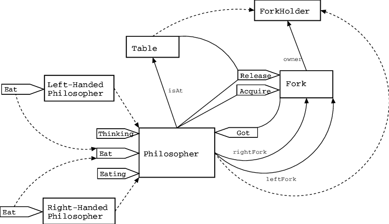

<div align="center">
  <a href="https://github.com/alexdrumi/philosophers">
    
  </a>
</div>

# PHILOSOPHERS
> PHILOSOPHERS is a project which teaches the basics of threading a process by simulating the dining philosophers problem.

<br>

## Table of Contents
* [General Info](#general-information)
* [Features](#features)
* [Usage](#usage)

## General Information
- In this project, I've gained a deeper understanding of threading, the usage of mutexes, and concurrency by simulating a working solution to the famous Dining Philosophers Problem.
- By tackling issues like resource sharing, synchronization, and deadlock avoidance, this project offers a hands-on look at how concurrent programs can be designed to be both correct and efficient.

## Features
- **Multi-Threaded implementation**  
  Each philosopher is handled by its own thread, allowing parallel operations and real concurrency.
- **Mutex-Based synchronization**  
  Forks (the shared resources) are protected by mutexes to prevent race conditions and inconsistent states.
- **Deadlock avoidance**  
  Implements logic to ensure the philosophers do not all get stuck waiting for forks forever.
- **Configurable parameters**  
  Number of philosophers, times to eat/sleep, and optional “meals to eat” can be adjusted through command-line arguments, letting you experiment with different scenarios.
- **Real-time logging**  
  Logs and displays philosopher actions (thinking, eating, sleeping) so you can monitor what happens at each step.
- **Timing & Exit Conditions**  
  Properly manages timing to prevent philosophers from starving indefinitely and ensures the simulation ends as intended.

## Usage

5. **Download the repository:**
   ```bash
   git clone git@github.com:alexdrumi/philosophers.git
   cd philosophers

6. **Compile and run the executable with some parameters (test other parameters yourself please):**
   ```bash
   make && ./philo 5 150 25 15 4

### ./philo [number of philosophers] [time to die] [time to eat] [time to sleep] [amount to eat (optional)]


